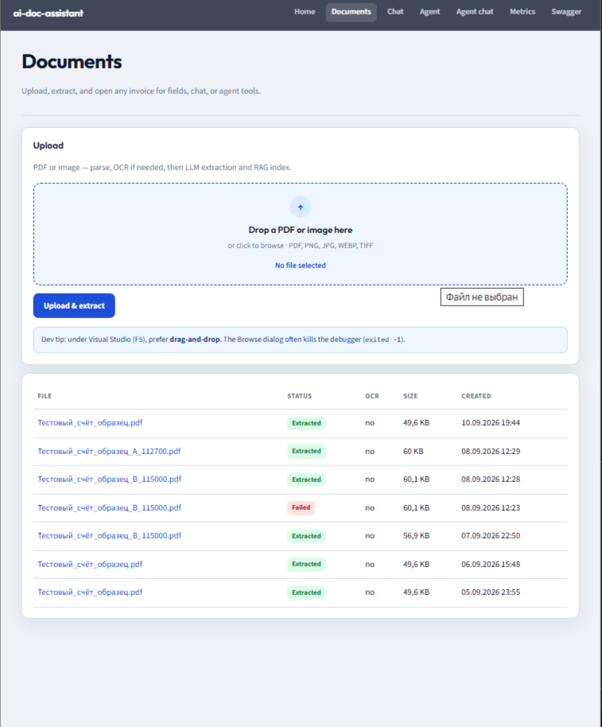
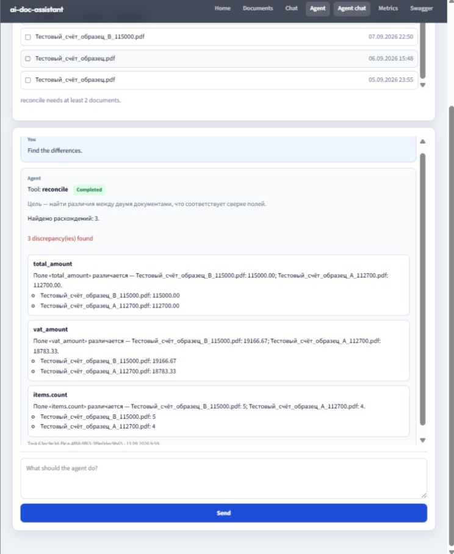
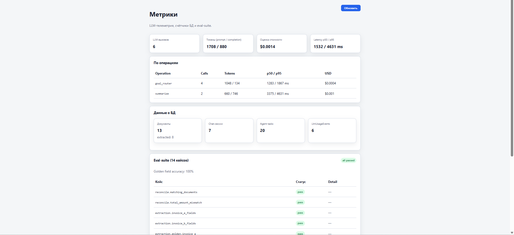
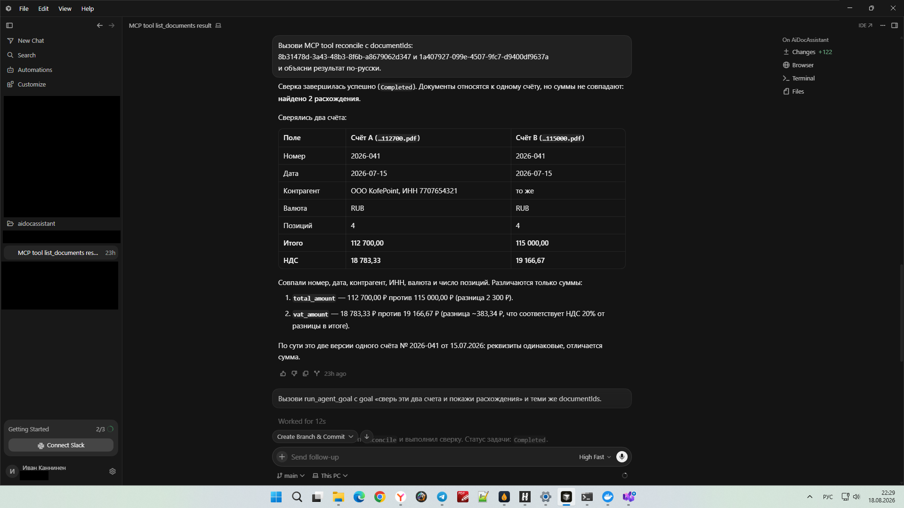
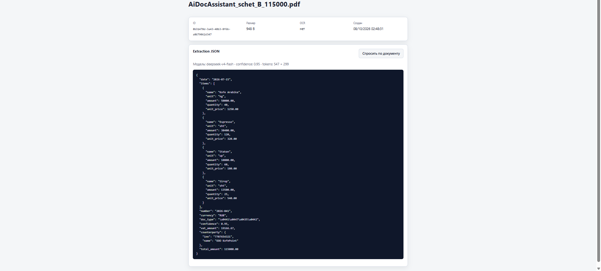
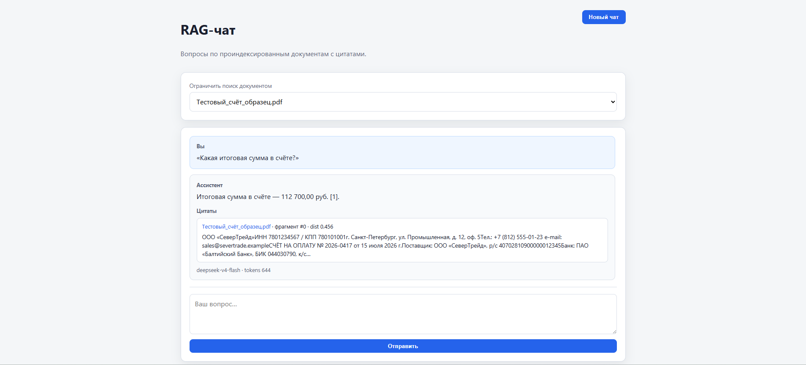
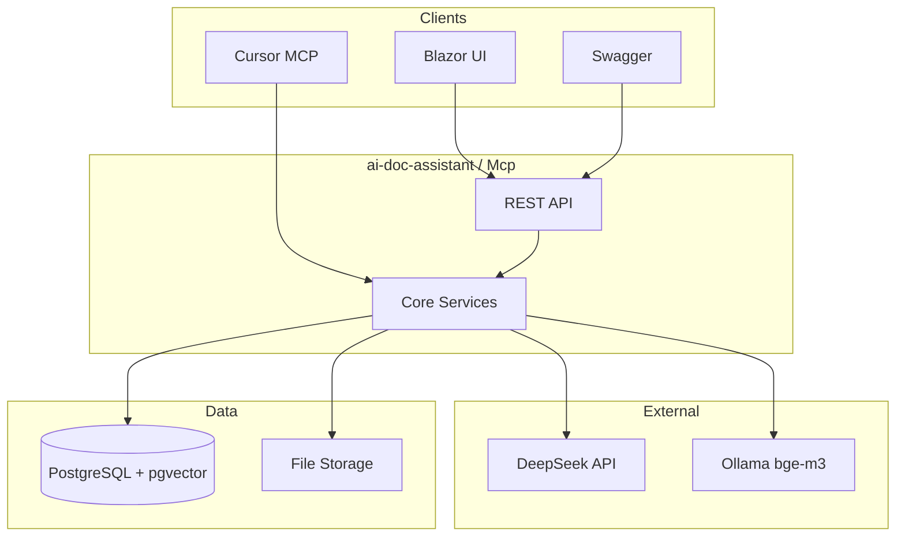

# AiDocAssistant

[](https://github.com/Vanchestery/ai-doc-assistant/actions/workflows/ci.yml)
[](https://dotnet.microsoft.com/)
[](tests/AiDocAssistant.Tests/)
[](https://github.com/pgvector/pgvector)
[](docker-compose.yml)
[](LICENSE)

**AI-ассистент для автоматизации документооборота бэк-офиса** — от PDF до agent chat и MCP в Cursor.

Загрузка счетов и сканов → structured extraction (LLM) → **agent chat** (цель → tool → результат в ленте) → RAG с цитатами → метрики, evals, MCP.

> *English:* Document AI pipeline on .NET 10 — extraction, conversational agent chat, pgvector RAG, observability, and Cursor MCP integration.

---

## Highlights (для ревьюера / HR)

| | |
|---|---|
| **Stack** | ASP.NET Core 10 · PostgreSQL + pgvector (HNSW) · EF Core · DeepSeek · Ollama embeddings |
| **AI patterns** | Structured extraction · Agent chat (goal → tool) · RAG with citations · MCP tools |
| **Quality** | 47 unit tests · 14 deterministic eval cases · LLM cost & latency (p50/p95) |
| **Delivery** | Docker one-command demo · Blazor UI · Swagger · [32 architectural decisions](DECISIONS.md) |
| **IDE integration** | MCP stdio server — Cursor calls your document tools from chat |

---

## Demo path (2 minutes)

1. Open http://localhost:8080/documents — upload two invoices (drag-and-drop), wait for **Extracted**.
2. Open http://localhost:8080/agent/chat — select both documents.
3. Send a goal, e.g. *“Compare these invoices and show the differences”*.
4. The router picks a tool (`reconcile` / `summarize` / `generate_report`) and shows the result in the chat lane.

Classic form UI remains at `/agent` (explicit tool + goal). MCP in Cursor is the same tools without the browser.

---

## Screenshots

| Documents | Agent chat (reconcile) | Metrics | MCP in Cursor |
|:---:|:---:|:---:|:---:|
|  |  |  |  |
| Extraction JSON | RAG chat + citations | | |
|  |  | | |

Social preview: upload `docs/screenshots/00-banner.png` in repo **Settings → General**.

---

## Architecture



**Projects:** `Core` (domain) · `Infrastructure` (EF, LLM, parsers) · `ai-doc-assistant` (API + Blazor) · `Mcp` (stdio tools) · `Tests` (xUnit)

---

## Features

- **Documents** — PDF text (PdfPig) + OCR (Tesseract) → LLM JSON extraction with validation
- **Agent chat** — plain-language goal → JSON router → `reconcile` / `summarize` / `generate_report` in a message lane
- **RAG chat** — chunking, 1024-dim embeddings, cosine search, answers with source citations
- **Agent (classic)** — same tools via `/agent` form (explicit tool or goal)
- **Metrics** — token usage, estimated USD, latency percentiles, DB counts, eval dashboard
- **MCP** — 9 tools for Cursor (`list_documents`, `reconcile`, `run_agent_goal`, …)

---

## Quick start

**Requires:** [Docker Desktop](https://www.docker.com/products/docker-desktop/)

```bash
git clone https://github.com/Vanchestery/ai-doc-assistant.git
cd ai-doc-assistant
cp .env.example .env   # set DEEPSEEK_API_KEY=sk-...
docker compose up --build -d
```

PowerShell (без `.env`):

```powershell
$env:DEEPSEEK_API_KEY = "sk-..."
docker compose up --build -d
```

| URL | Description |
|-----|-------------|
| http://localhost:8080/ | Blazor UI |
| http://localhost:8080/swagger | OpenAPI |
| http://localhost:8080/health | Health check |

**VS dev:** `docker compose up db -d` → run `ai-doc-assistant` (port **5208**). Для загрузки PDF в F5 удобнее drag-and-drop (системный Browse под Interactive Server на Windows иногда роняет процесс).

### Secrets

| Key | Where |
|-----|--------|
| `DeepSeek:ApiKey` | `.env` → `DEEPSEEK_API_KEY`, PowerShell `$env:DEEPSEEK_API_KEY`, or `dotnet user-secrets set "DeepSeek:ApiKey" "sk-..." --project ai-doc-assistant` |
| Embeddings | [Ollama](https://ollama.com/) on host with `bge-m3` (Docker uses `host.docker.internal:11434`) |
| OCR (local Windows) | [Tesseract](https://github.com/UB-Mannheim/tesseract/wiki) + [poppler](https://github.com/oschwartz10612/poppler-windows/releases) in PATH |

---

## API overview

<details>
<summary><b>Documents · Chat · Agent · Metrics</b></summary>

**Documents:** `POST/GET /api/documents`, `GET /api/documents/{id}` — upload, list, extraction JSON

**RAG chat:** `POST /api/chat/sessions`, `POST .../messages`, `GET .../sessions/{id}` — Q&A with citations

**Agent:** `GET /api/agent/tools` · `POST /api/agent/tasks` · `POST /api/agent/goals` · `GET /api/agent/tasks/{id}/report`

**Metrics:** `GET /api/metrics/summary` · `GET /api/metrics/evals`

**UI routes:** `/`, `/documents`, `/chat`, `/agent`, `/agent/chat`, `/metrics`

</details>

---

## MCP (Cursor)

Stdio server sharing the same domain services as the Web API.

```bash
dotnet user-secrets set "DeepSeek:ApiKey" "sk-..." --project src/AiDocAssistant.Mcp
```

Copy [`mcp.json.example`](mcp.json.example) → `.cursor/mcp.json`, enable in **Cursor Settings → MCP**.

**Tools:** `list_documents`, `get_document`, `list_agent_tools`, `reconcile`, `summarize`, `generate_report`, `run_agent_goal`, `get_agent_task`, `get_metrics_summary`

---

## Production deploy

```bash
docker compose -f docker-compose.yml -f docker-compose.prod.yml up --build -d
```

Volumes `pgdata` and `uploads` persist across restarts (`docker compose down` keeps data; `down -v` wipes it).

---

## Development

```bash
dotnet test ai-doc-assistant.slnx   # 47 tests
dotnet build ai-doc-assistant.slnx
```

Architecture decisions and trade-offs: **[DECISIONS.md](DECISIONS.md)** (32 entries, phases 0–6).

---

## Project status

- [x] Phase 0 — scaffold, Docker, migrations, health, Swagger
- [x] Phase 1 — document upload, OCR, LLM extraction
- [x] Phase 2 — RAG (embeddings, pgvector, chat + citations)
- [x] Phase 3 — agent tools + goal-mode
- [x] Phase 4 — evals, LLM telemetry, metrics
- [x] Phase 5 — Blazor UI + prod compose
- [x] Phase 6 — MCP stdio server
- [x] Agent chat UI — `/agent/chat` (one message ≈ one tool run)

---

## Author

**Иван** — [.NET + AI portfolio project](https://github.com/Vanchestery/ai-doc-assistant)

Questions or demo walkthrough — open an issue or contact via GitHub profile.
